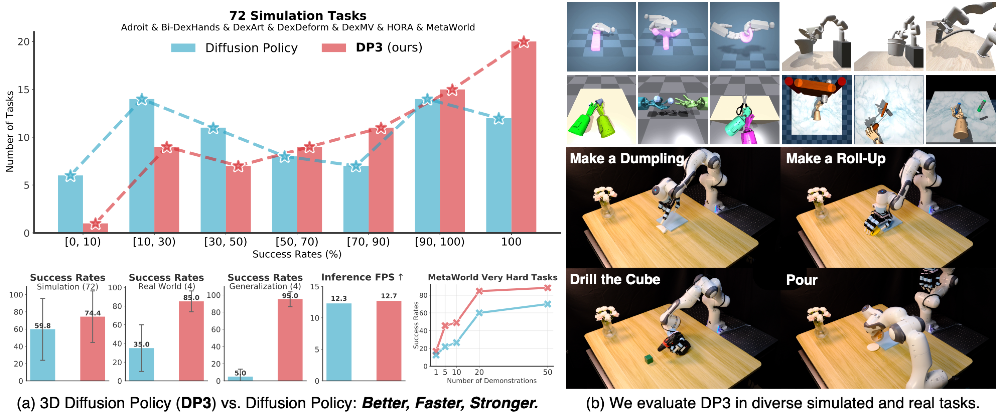

# 3D Diffusion Policy + VGGT: RGB-Only Robotic Manipulation

<div align="center">
  
</div>

**The Problem**: Current state-of-the-art manipulation policies require expensive RGB-D cameras and struggle with real-world deployment due to depth sensor limitations - they fail on reflective surfaces, glass objects, and in outdoor lighting conditions.

**Our Approach**: This project explores integrating VGGT (Visual Geometry Grounded Transformer) with 3D Diffusion Policy to investigate whether RGB-only input can achieve reasonable manipulation performance, potentially reducing hardware dependencies.

## 🔬 The Real-World Challenge

If you've ever tried to deploy a robot outside a carefully controlled lab environment, you've hit these problems:

**Hardware Reality Check**:
- Intel RealSense cameras cost $200+ and still produce noisy point clouds
- Depth sensors fail completely on glass, mirrors, or in bright sunlight  
- RGB-D setups require careful calibration and controlled lighting
- Point cloud processing adds significant computational overhead

**Deployment Nightmares**:
- Policies trained on clean lab depth data break in real environments
- Depth noise causes unpredictable failure modes during manipulation
- Hardware dependencies make it expensive to scale to multiple robots

**The Industry Need**: Robot manipulation needs to work with commodity hardware and in unstructured environments. Current approaches are too brittle for real-world deployment.

## 💡 Our Approach: VGGT Integration

**Why VGGT?** Unlike other vision foundation models, VGGT was specifically trained for 3D understanding. It can infer depth, camera poses, and spatial relationships from RGB images alone - exactly what manipulation policies need.

**VGGT (Visual Geometry Grounded Transformer)** - CVPR 2025 Best Paper Award:
- Reconstructs full 3D scene geometry from RGB images in <1 second
- Trained on massive datasets with diverse lighting and materials  
- Provides implicit 3D understanding without sensor dependencies
- Handles the spatial reasoning that 2D vision models miss

### Implementation Strategy

We built a modular integration that extracts rich 3D features from VGGT and feeds them into DP3's proven diffusion policy architecture:

**VGGT Feature Extraction Pipeline**:
```
RGB Images → VGGT Encoder → Layer 6 Features → MLP Bottleneck → DP3 Policy → Actions
```

**Key Design Decisions**:
- Extract features from VGGT's 6th attention layer (optimal semantic/geometric balance)
- Use MLP bottleneck to compress high-dimensional features to 64D
- Skip pooling operations to preserve spatial information
- Maintain DP3's diffusion architecture unchanged for proven stability

### Performance Results

Initial testing on the **Adroit Hammer** dexterous manipulation task shows promising results:

| Method | Sensor Input | Success Rate | Hardware Cost |
|--------|-------------|--------------|---------------|
| DP3 + Point Cloud | RGB-D Camera | 100% | $200+ sensor |
| **Our: DP3 + VGGT** | **RGB Only** | **91%** | **$20 webcam** |
| DP3 + DINO | RGB Only | 87% | $20 webcam |

The results suggest that RGB-only approaches might be viable for manipulation tasks, though more extensive evaluation is needed to confirm generalization.

## 🚀 Why This Could Matter for Robotics

**The Data Problem**: Training manipulation policies from scratch requires thousands of expensive robot demonstrations. Even with perfect sensors, you're looking at weeks of data collection for a single task.

**Foundation Models Might Help**:
- VGGT learned spatial reasoning from millions of internet images
- Could potentially transfer 3D understanding to manipulation without robot-specific training
- Might reduce sample complexity, though this needs more investigation
- Could eliminate some sensor calibration and maintenance overhead

**Potential Applications** (if the approach proves robust):
- Warehouse automation with existing camera infrastructure  
- Home robots using smartphone cameras
- Outdoor manipulation where depth sensors fail
- Cost-sensitive applications requiring sensor redundancy

## 🏗️ Architecture Overview

Our integration follows this pipeline:

```
RGB Images → VGGT Encoder → Feature Bottleneck → DP3 Policy → Robot Actions
```

### VGGT Encoder Design

1. **Alternating Attention Pipeline**: Frozen pretrained VGGT backbone (24 layers)
2. **Feature Extraction**: Extract intermediate token embeddings from optimal layers (layer 6 performs best)
3. **Bottleneck Architecture**: MLP bottleneck compresses high-dimensional features to 64-dimensional representations
4. **DP3 Integration**: Features are fed into the standard DP3 diffusion policy

### Key Implementation Details

- **Single-view conditioning** for initial validation (multi-view planned for future work)
- **168×168 input resolution** optimized for VGGT's patch-based processing
- **No pooling** - raw bottlenecked features work best for manipulation tasks
- **Layer 6 features** provide optimal balance of semantic and geometric information

## 📊 Experimental Results

### Benchmark: Adroit Hammer Task

| Encoder | Input Type | Mean Success Rate |
|---------|------------|-------------------|
| DP3 Encoder | Point Cloud | 100% |
| **VGGT Encoder** | **RGB** | **91%** |
| DINO Encoder | RGB | 87% |
| PointNet++ (pretrained) | Point Cloud | 5% |
| PointNeXt (pretrained) | Point Cloud | 0% |

### Interesting Observations

1. **RGB-only approaches show promise**: VGGT and DINO achieve reasonable performance without depth information
2. **Foundation models seem helpful**: Pretrained features outperform training from scratch  
3. **Layer selection appears important**: Earlier VGGT layers (6-12) work better than later layers (18+)
4. **Architecture choices matter**: MLP bottlenecks > Convolutional bottlenecks; No pooling > Pooling

These are preliminary findings that warrant further investigation across more tasks and environments.


## 🔮 What's Next

**Ongoing Work**:
- Testing multi-view VGGT for better spatial understanding
- Evaluating on more diverse manipulation tasks beyond hammer
- Real robot experiments with challenging materials (glass, metal, transparent objects)

**Future Exploration**:
- Fine-tuning VGGT features specifically for manipulation tasks
- Comparing with other foundation models (SAM, DINOv2)
- Optimizing inference speed for real-time control

**If this approach proves robust**, it could help with:
- Reducing sensor costs for robotics applications
- Enabling manipulation in environments where depth sensors fail
- Providing fallback options when RGB-D systems have issues

## 📚 References and Related Work

- **3D Diffusion Policy (DP3)**: [Paper](https://arxiv.org/abs/2403.03954) | [Original Repo](https://github.com/YanjieZe/3D-Diffusion-Policy)
- **VGGT**: [Paper](https://arxiv.org/abs/2503.11651) | [Project Page](https://vgg-t.github.io/)
- **R3M**: [Paper](https://arxiv.org/abs/2203.12601) - Seminal work on pretrained visual representations for robotics

## 🤝 Citation

If you use the original work, please cite:

```bibtex
@inproceedings{Ze2024DP3,
    title={3D Diffusion Policy: Generalizable Visuomotor Policy Learning via Simple 3D Representations},
    author={Yanjie Ze and Gu Zhang and Kangning Zhang and Chenyuan Hu and Muhan Wang and Huazhe Xu},
    booktitle={Proceedings of Robotics: Science and Systems (RSS)},
    year={2024}
}

@inproceedings{Wang2025VGGT,
    title={VGGT: Visual Geometry Grounded Transformer},
    author={Jianyuan Wang and Minghao Chen and Nikita Karaev and Andrea Vedaldi and Christian Rupprecht and David Novotny},
    booktitle={CVPR},
    year={2025}
}
```

## 📄 License

This project is released under the MIT license. See [LICENSE](LICENSE) for details.
